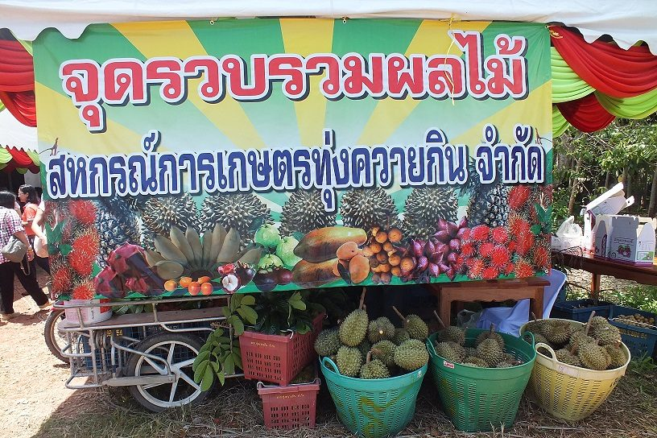
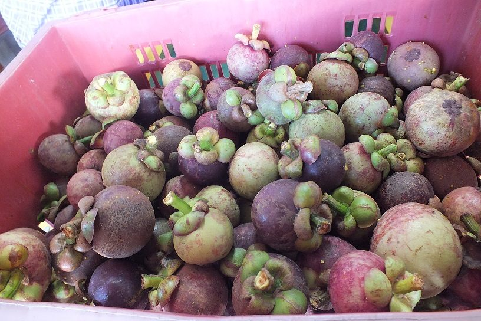
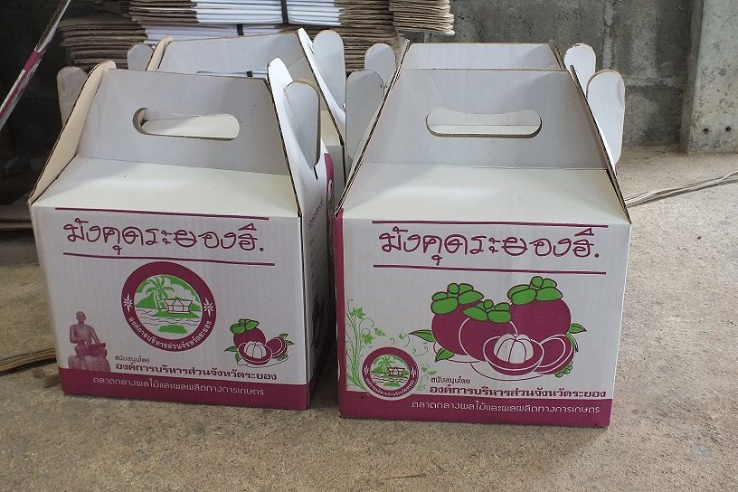
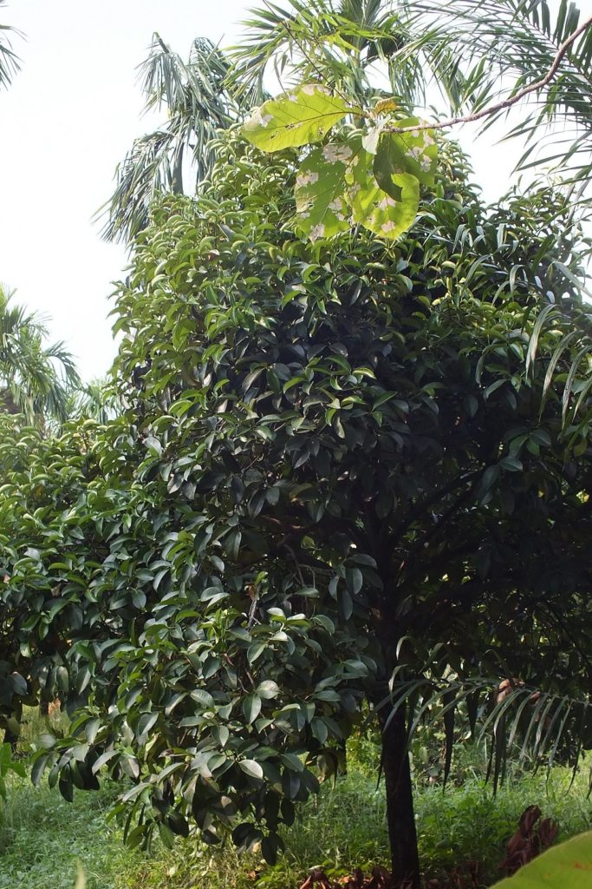
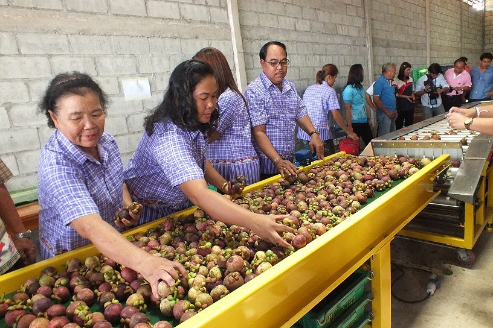
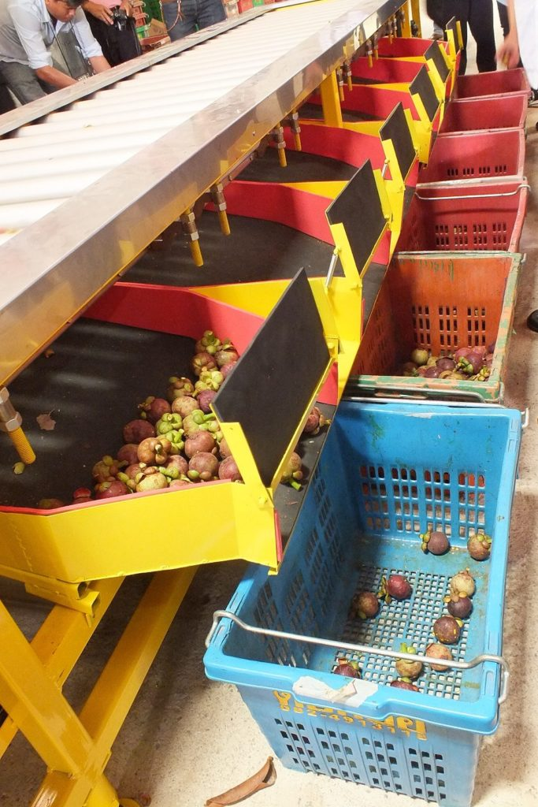

เมืองไทย ปลูกมังคุดแค่พันธุ์เดียว เรียกว่า “ มังคุดพันธุ์พื้นเมือง ” เกิดจากการเพาะเมล็ด  เนื่องจากเมล็ดมังคุดไม่ได้เกิดจากการผสมเกสร จึงไม่มีโอกาสกลายพันธุ์ได้เลย เพราะเกสรตัวผู้ของดอกมังคุดเป็นหมัน เมล็ดจึงเจริญจากเนื้อเยื่อของต้นแม่โดยไม่ได้รับการผสมเกสร จึงเชื่อกันว่ามังคุดมีพันธุ์เดียว อย่างไรก็ตามพบว่า มังคุดเมืองนนท์มีผลเล็กและเปลือกบางกว่า มังคุดภาคใต้ที่มีเปลือกหนา แต่ยังไม่มีการศึกษาเปรียบเทียบให้เห็นชัดเจนพอที่จะแยกเป็นพันธุ์ได้

เมืองไทย ปลูกมังคุดแค่พันธุ์เดียว เรียกว่า “ มังคุดพันธุ์พื้นเมือง ” เกิดจากการเพาะเมล็ด  เนื่องจากเมล็ดมังคุดไม่ได้เกิดจากการผสมเกสร จึงไม่มีโอกาสกลายพันธุ์ได้เลย เพราะเกสรตัวผู้ของดอกมังคุดเป็นหมัน เมล็ดจึงเจริญจากเนื้อเยื่อของต้นแม่โดยไม่ได้รับการผสมเกสร จึงเชื่อกันว่ามังคุดมีพันธุ์เดียว อย่างไรก็ตามพบว่า มังคุดเมืองนนท์มีผลเล็กและเปลือกบางกว่า มังคุดภาคใต้ที่มีเปลือกหนา แต่ยังไม่มีการศึกษาเปรียบเทียบให้เห็นชัดเจนพอที่จะแยกเป็นพันธุ์ได้

#### มังคุดระยองฮิ

“  ทุ่งควายกิน “ เป็นหนึ่งในตำบลเก่าแก่ ของอำเภอแกลง จังหวัดระยอง ผู้เฒ่าผู้แก่เล่าว่า  ในอดีตทุ่งควายกิน มีสภาพเป็นทุ่งร้างกลางป่าล้อมรอบ ด้วยสภาพทุ่งนาแห่งนี้มีความอุดมสมบูรณ์ ชาวบ้านจึงนิยมนำกระบือมาเลี้ยงในแหล่งนี้เป็นจำนวนมาก ชาวบ้านจึงเรียกทุ่งแห่งนี้ว่า “ ทุ่งควายกิน ” มาจนถึงทุกวันนี้

ปัจจุบันชาวบ้านส่วนใหญ่ในตำบลทุ่งควายกิน มีอาชีพปลูกไม้ผลนานาชนิดเป็นรายได้หลักเลี้ยงครอบครัว  ผลไม้ที่นี่รสอร่อยถูกปากผู้บริโภคที่มีซื้อขายกันทั่วไปได้แก่  มังคุด เงาะ ทุเรียน สละ และลองกอง ฯลฯ  ไม้ผลเหล่านี้ช่วยสร้างงานอาชีพและสร้างรายได้ที่มั่นคงให้แก่เกษตรกรมาอย่างต่อเนื่อง

ปัญหาผลไม้ล้นตลาดและมีราคาตกต่ำ ทำให้เกษตรกรในตำบลทุ่งควายกินหันมาร่วมพลัง กันจัดตั้ง   “  สหกรณ์การเกษตรทุ่งควายกิน ” เมื่อประมาณปี 2551 เพื่อทำหน้าที่วางแผนจัดการผลผลิตและการตลาดอย่างเป็นระบบ ส่งเสริมให้สมาชิกผลิตไม้ผลที่มีคุณภาพดีและได้มาตรฐานตามที่ตลาดผู้ซื้อต้องการ

สหกรณ์การเกษตรทุ่งควายกิน ทำหน้าที่เป็นศูนย์กลางรับซื้อผลผลิตจากสมาชิก รวมถึงเครือข่ายสหกรณ์ในจังหวัดระยองและพื้นที่ใกล้เคียง เฉลี่ยปีละ 600-800 ตัน  ผลผลิตที่รับซื้อจากสมาชิกจะถูกนำไปคัดแยกเกรดก่อนป้อนเข้าสู่ตลาด การจัดการผลผลิตที่เป็นระบบ ทำให้สหกรณ์ฯ สามารถคัดเลือกผลผลิตคุณภาพดี และมีมาตรฐานจีเอพีตามที่ตลาดผู้ซื้อต้องการ ช่วยยกระดับราคาขายสินค้าของกลุ่มสหกรณ์ฯ ให้สูงขึ้นกว่าในอดีต สินค้าผลไม้ของสหกรณ์ จะถูกส่งไปจำหน่ายทั้งในประเทศและต่างประเทศ มียอดขายกว่าปีละ  200 ตัน คู่ค้ารายใหญ่ คือ  เวียดนามสาธารณรัฐประชาชนจีน  เป็นต้น

#### มังคุด ปลูกดูแลง่าย

มังคุดเป็นไม้ผลที่ต้องการอุณหภูมิสูง และความชื้นสัมพัทธ์ในอากาศสูงตลอดช่วงของการเจริญเติบโต ดินที่ปลูกควรเป็นดินร่วนปนทราย มีการระบายน้ำดี มีความเป็นกรดเป็นด่างประมาณ 5.5-6.5 ที่สำคัญคือ พื้นที่ปลูกต้องมีน้ำเพียงพอตลอดในช่วงฤดูแล้ง เพราะต้องมีการกระตุ้น เพื่อชักนำให้เกิดการออกดอก

  สิ้นสุดฤดูมังคุด ต้องใส่ปุ๋ยบำรุงต้นให้มีสภาพสมบูรณ์ และสะสมอาหารอย่างเต็มที่ก่อนให้ผลผลิตในรุ่นต่อไป เมื่อต้นมังคุดเริ่มแตกยอด  ต้องดูแลไม่ให้หนอนแมลงทำลายยอด  ช่วงระยะแตกใบอ่อน ควรใส่ปุ๋ยเคมีที่มีธาตุอาหารตัวกลางสูง ๆ เพื่อช่วยให้ต้นมังคุดออกดอกได้อย่างเต็มที่    เมื่อต้นมังคุดเริ่มออกผล ใส่ปุ๋ยเคมีสูตร 13-13-21 บำรุงต้นเพื่อเร่งการพัฒนาเนื้อ และให้น้ำอย่างสม่ำเสมอ การเติบโตของผลมังคุดสามารถแบ่งออกได้เป็นหลายระยะ คือ    วัยที่ 1 สีเขียวตองอ่อน วัยที่ 2 ผลมีสายเลือด (เกิดจุดแต้ม หรือประสีม่วงแดง) วัยที่ 3 ผลมีการเปลี่ยนแปลงเป็นสีน้ำตาลแดงเรื่อๆ  วัยที่ 4 ผลมีสีน้ำตาลแดง  วัยที่ 5 ผลมีสีม่วงแดง  วัยที่ 6 ผลมีสีม่วงเข้ม ช่วงเก็บเกี่ยว ควรใช้ไม้สอยอย่างถูกวิธี เพื่อไม่ให้ผลมังคุดตกดิน ซึ่งจะมีผลต่อคุณภาพของมังคุด

#### โรคแมลงศัตรูพืช

ช่วงที่มีฝนตก ความชื้นสัมพัทธ์ในอากาศสูง การระบายอากาศบริเวณใต้ต้นไม่ดีทำให้มีความชื้นสูง ให้ระวังการระบาดของเพลี้ยไฟทำลายดอกและใบอ่อนในระยะเริ่มออกดอก เนื่องจากมีฝนหลงฤดูทำให้มังคุดมีการแตกใบอ่อนปะปนการออกดอก หรือแตกใบอ่อนอย่างเดียว หรือออกดอกอย่างเดียวในแต่ละต้น และดอกมักมีแผลสีน้ำตาลจากการทำลายของเพลี้ยไฟ  ส่วนใบจะแสดงอาการหงิกงอและมีสีน้ำตาล

กรมวิชาการเกษตร แนะนำให้เกษตรกรสำรวจการระบาด หากพบเพลี้ยไฟจำนวน 1 ตัวต่อยอด ให้พ่นสารอิมิดาโคลพริด 10% เอสแอล อัตรา 10 มิลลิลิตรต่อน้ำ 20 ลิตร หรือสารคาร์โบซัลแฟน 20% อีซี อัตรา 50 มิลลิลิตรต่อน้ำ 20 ลิตร หรือสารฟิโปรนิล 5% เอสซี อัตรา 10 มิลลิลิตรต่อน้ำ 20 ลิตร และไม่ควรพ่นสารชนิดใดชนิดหนึ่งติดต่อกันหลายครั้ง เพราะจะทำให้เพลี้ยไฟต้านทานสารฆ่าแมลงได้

สำหรับแมลงศัตรูพืชที่พบเข้าทำลายมังคุดในช่วงนี้ คือ หนอนกินใบอ่อน มักพบระบาดในระยะออกดอก โดยหนอนจะกัดกินใบของมังคุดทำให้ได้รับความเสียหาย หากพบหนอนกัดกินใบอ่อนเข้าทำลายประมาณ 20% ของยอด ให้พ่นสารคาร์บาริล 85% ดับบลิวพี อัตรา 60 กรัมต่อน้ำ 20 ลิตร พ่น 2 ครั้งห่างกัน 5 วัน และหนอนชอนใบ มักพบในระยะออกดอกเช่นกัน โดยใบมังคุดจะมีอาการหงิก เมื่อสังเกตใต้ใบจะพบรอยทางยาวเป็นเส้นสีขาว เนื่องจากการทำลายของหนอนชอนใบ หากพบหนอนกัดกินใบอ่อนเข้าทำลายประมาณ 30% ของยอด ให้พ่นสารคาร์บาริล 85% ดับบลิวพี อัตรา 60 กรัมต่อน้ำ 20 ลิตร พ่น 2 ครั้งห่างกัน 10 วัน

นอกจากนี้ ในช่วงฤดูฝนหรือมีฝนตกหนักในพื้นที่จนมีความชื้นสะสมในดินสูง เกษตรกรผู้ปลูกมังคุดจะพบการระบาดมากของโรคใบจุดที่เกิดจากเชื้อรา มักพบได้ในระยะเริ่มสร้างดอกและหลังการตัดแต่งกิ่งมังคุด โดยจะเกิดแผลจุดสีน้ำตาลบนใบ  ขอบแผลสีน้ำตาลเข้มล้อมรอบด้วยวงสีเหลือง ขนาดและรูปร่างไม่แน่นอน บริเวณตรงกลางแผลเก่าจะพบจุดแข็งสีดำขนาดเล็กขึ้นกระจายอยู่ทั่วไป หากเป็นรุนแรงจะทำให้สูญเสียพื้นที่ใบในการสร้างอาหาร ใบหงิกงอผิดรูป ไม่เจริญเติบโต และเล็กผิดปกติ ใบจะแห้งและร่วงหมด มีส่วนทำให้ผลมังคุดมีผิวไม่เป็นมันเงา เนื่องจากได้รับแสงมากเกินไป มีใบปกคลุมน้อย และยังทำให้ยอดอ่อนแห้งและตายได้ เชื้อราสามารถแพร่ระบาดได้ทางลมและน้ำ

โรคใบจุดที่เกิดจากเชื้อรามักเกิดในสวนมังคุดที่มีการจัดการไม่ดี ปล่อยให้ต้นมีใบแน่นทึบเกินไป จึงควรทำความสะอาดแปลงโดยการตัดแต่งทรงพุ่มให้โปร่ง โดยเฉพาะใบที่อยู่ด้านล่างๆ ให้มีการถ่ายเทของอากาศ ไม่ให้มีความชื้นสะสมใต้ทรงพุ่มมากเกินไป และเกษตรกรควรหมั่นสำรวจอาการของโรคอย่างสม่ำเสมอ  หากพบว่าเริ่มมีการระบาดมากช่วงแตกใบอ่อน ให้ฉีดพ่นสารป้องกันกำจัดโรคพืชคาร์เบนดาซิม 50% ดับบลิวพี อัตรา 10-20 กรัมต่อน้ำ 20 ลิตร หรือสารคอปเปอร์อ๊อกซี่คลอไรด์ 85% ดับบลิวพี อัตรา 30-80 กรัมต่อน้ำ 20 ลิตร หรือสารแมนโคเซบ 80% ดับบลิวพี อัตรา 50 กรัมต่อน้ำ 20 ลิตร ทุก 7-10 วัน จำนวน 1-2 ครั้ง

---

##### Cradit

- [เทคโนโลยีชาวบ้าน](https://www.technologychaoban.com/agricultural-technology/article_20134)