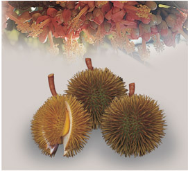
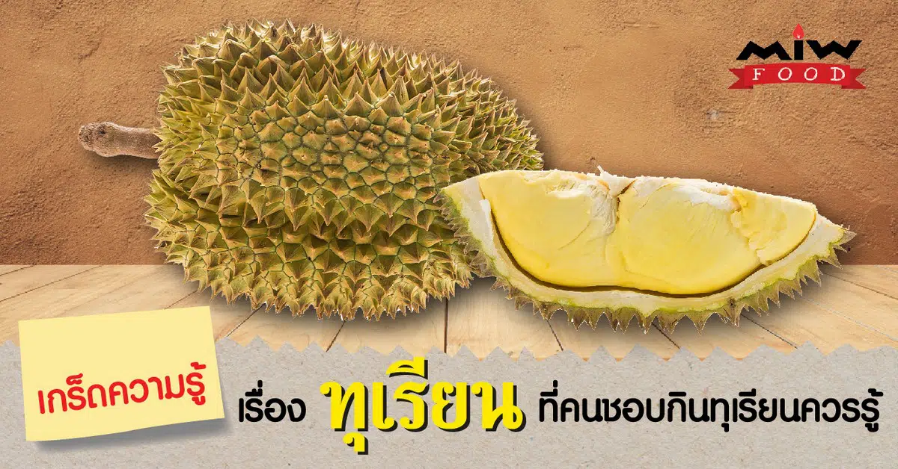

## ประวัติของผลไม้

### สมัยอยุธยา

ใน พ.ศ. ๒๒๒๘ พระเจ้าหลุยส์ ที่ ๑๔ แห่งประเทศฝรั่งเศส ทรงส่งคณะราชทูตอัญเชิญพระราชสาส์นมาถวายสมเด็จพระนารายณ์มหาราช ณ กรุงศรีอยุธยา เพื่อเจริญสัมพันธไมตรี และเผยแผ่คริสต์ศาสนา รวมทั้งทำสัญญาสิทธิทางการค้า ในวาระที่ คณะราชทูตฝรั่งเศสกราบถวายบังคมลากลับ สมเด็จพระนารายณ์มหาราช ทรงส่งคณะราชทูตไทยตามไปฝรั่งเศส เพื่อเจริญสัมพันธไมตรีด้วยเช่นกัน ตอนกลับ พระเจ้าหลุยส์ที่ ๑๔ ทรงส่งคณะราชทูตตามมาด้วยอีกคณะหนึ่ง เดินทางมาถึงกรุงศรีอยุธยา เมื่อเดือนกันยายน พ.ศ. ๒๒๓๐ โดยมี เมอร์ซิเออร์ เดอลาลูแบร์ (Monsieur de la Loubre) นักบวชนิกายเยซูอิต เป็นหัวหน้าคณะราชทูต เพื่อมาเจรจาทำสัญญาทางด้านการค้ากับไทยอีกคราวหนึ่ง จนเป็นผลสำเร็จ เมอร์ซิเออร์ เดอลาลูแบร์ ซึ่งเป็นนักการทูต และนักเขียน ที่มีชื่อเสียง ได้บันทึกสิ่งต่างๆ ที่ได้พบเห็น เกี่ยวกับสภาพแวดล้อมทางสังคม และชีวิตความเป็นอยู่ของคนไทย รวมทั้งเกษตรกรรม ของเมืองไทยบางส่วน และนำไปเขียนเป็นหนังสือเกี่ยวกับเมืองไทยสมัยอยุธยา ในช่วงแผ่นดินสมเด็จพระนารายณ์มหาราช ตีพิมพ์เป็นภาษาฝรั่งเศสในกรุงปารีส เมื่อ พ.ศ. ๒๓๓๖ มีขนาดความยาว ๒ เล่ม ในเรื่องที่เกี่ยวกับเกษตรกรรมของไทย ตอนหนึ่งได้ระบุเรื่องเกี่ยวกับทุเรียนไว้ว่า

**"ดูเรียน"** (<u>Durion</u>) ชาวสยามเรียกว่า **“ทูลเรียน”** (<u>Tourrion</u>) เป็นผลไม้ที่นิยมกันมากในแถบนี้ แต่สำหรับข้าพเจ้า ไม่สามารถทนต่อกลิ่นเหม็นอันรุนแรงของมันได้ ผลมีขนาดเท่าผลแตง มีหนามอยู่โดยรอบ ดูๆ ไป ก็คล้ายกับขนุนเหมือนกัน มีเมล็ดมาก แต่เมล็ดใหญ่ขนาดเท่าไข่ไก่ ซึ่งเป็นส่วนที่ใช้กิน ภายในยังมีอยู่อีกเมล็ดหนึ่ง ถือกันว่า ยิ่งมีเมล็ดในน้อย ยิ่งเป็นทูลเรียนดี อย่างไรก็ตาม ในผลหนึ่งๆ ไม่เคยปรากฏว่า มีน้อยกว่า ๓ เมล็ดเลย

จากหลักฐานดังกล่าว แสดงให้เห็นว่า มีการปลูกทุเรียนในภาคกลางของประเทศไทย ตั้งแต่สมัยอยุธยา ส่วนจะเข้ามาจากที่ไหน และโดยวิธีใด ไม่ปรากฏหลักฐาน แต่น่าเชื่อถือได้ว่า เป็นการนำมาจากภาคใต้ของประเทศไทยนั่นเอง และมีการปรับปรุงพันธุ์อย่างสม่ำเสมอตลอดมา โดยระบบของสังคมไทย เช่น การนิยมเอาผลไม้ดีที่สุดถวายพระ หรือเป็นของกำนัลเจ้านาย รวมทั้งระบบของรัฐ เช่น การเก็บอากรเกี่ยวกับต้นผลไม้ เป็นการส่งเสริมแกมบังคับ ให้ทุกคนต้องปรับปรุงพืชผลของตนเอง ส่งผลให้เมืองไทยมีพันธุ์ไม้ผลดีๆ หลากหลายชนิด มาจนถึงสมัยปัจจุบัน แสดงให้เห็นว่า งานปรับปรุงพันธุ์ไม้ผลของประเทศไทยโดยชาวบ้าน ได้เริ่มตั้งแต่สมัยอยุธยาเป็นต้นมา และเป็นมรดกตกทอดจากบรรพบุรุษสู่ชนรุ่นปัจจุบัน

---

### สมัยรัตนโกสินทร์

พระยาแพทย์พงศาวิสุทธาธิบดี (<u>สุ่น สุนทรเวช</u>) ได้กล่าวถึงการแพร่กระจายพันธุ์ของทุเรียน จากจังหวัดนครศรีธรรมราช มายังกรุงเทพฯ ตั้งแต่ประมาณ พ.ศ. ๒๓๑๘ และมีการทำสวนทุเรียนในตำบลบางกร่าง ในคลองบางกอกน้อยตอนใน มาตั้งแต่ พ.ศ. ๒๓๙๗

ในระยะต้น เป็นการขยายพันธุ์ด้วยเมล็ด และพัฒนามาเป็นการปลูกด้วยกิ่งตอน จากพันธุ์ดี ๓ พันธุ์ คือ อีบาตร ทองสุก และการะเกด ผู้ที่หากิ่งตอนจากพันธุ์ดีทั้ง ๓ พันธุ์ไม่ได้ ก็ต้องใช้เมล็ดของทั้ง ๓ พันธุ์นั้นเป็นพันธุ์ปลูก ทำให้เกิดทุเรียนลูกผสมขึ้นมากมาย เป็นผลดีต่อการปรับปรุงพันธุ์ทุเรียนมาจนถึงปัจจุบัน

ดังได้กล่าวข้างต้น ปัญหาที่เกษตรกรไม่สามารถหากิ่งตอนจากพันธุ์ดีได้ จึงต้องใช้เมล็ดเป็นพันธุ์ปลูก การขยายพันธุ์ด้วยเมล็ด จึงมีมาตั้งแต่ พ.ศ. ๒๓๙๗ จนกระทั่งก่อนเกิดน้ำท่วมใหญ่ใน พ.ศ. ๒๔๘๕ นับเป็นเวลากว่า ๘๗ ปี ทำให้เกิดทุเรียนพันธุ์ลูกผสมขึ้นมากมาย และมีการขยายพันธุ์ปลูกในที่ต่างๆ เมื่อเกิดเหตุการณ์น้ำท่วมใหญ่ใน พ.ศ. ๒๔๘๕ ทำให้ทุเรียนพันธุ์ต่างๆ หลายพันธุ์ ในเขตจังหวัดนนทบุรี และธนบุรีสูญหาย เพราะสวนล่ม แต่ก็ยังมีหลายสวน ที่รอดพ้นมาได้ จึงกลายเป็นแหล่งพันธุ์ ที่เหลืออยู่ แต่เนื่องจากการขยายพันธุ์ปลูก ทำได้ไม่รวดเร็วพอ เกษตรกรจึงต้องใช้เมล็ดเป็นพันธุ์ปลูก ทำให้ได้ทุเรียนพันธุ์ลูกผสมเพิ่มเติม จากที่มีเหลืออยู่ อย่างไรก็ตาม เนื่องจากการขาดความรู้ และหลักเกณฑ์ทางวิชาการ ทุเรียนพันธุ์ต่างๆ จำนวนมากมายที่เกิดขึ้น จึงเป็นทุเรียนพันธุ์ลูกผสมตามธรรมชาติ ไม่สามารถทราบเชื้อสายพันธุกรรมของพ่อแม่พันธุ์ ขาดการบันทึกประวัติเป็นลายลักษณ์อักษรทางวิชาการ การตั้งชื่อพันธุ์ก็ไม่มีหลักเกณฑ์ อาจใช้ชื่อของผู้ที่เพาะเมล็ด ชื่อสถานที่ หรือตำแหน่งที่ต้นพันธุ์นั้นงอกหรือเจริญเติบโต ลักษณะรูปทรงของผล สี รสชาติ ฯลฯ ที่เป็นลักษณะที่เด่นชัดเป็นตัวกำหนดในการตั้งชื่อ ประกอบกับมีการกระจายการปลูกทุเรียนไปยังภาคต่างๆ ทำให้มีการกระจายพันธุ์ไปยังแหล่งปลูกใหม่เป็นจำนวนมาก รายชื่อพันธุ์ทุเรียน ที่รวบรวมได้จากเอกสารจึงมีเป็นจำนวนมากถึง ๒๒๗ พันธุ์ ซึ่งในจำนวน ๒๒๗ พันธุ์นี้ อาจมีหลายๆ พันธุ์ ที่เป็นพันธุ์เดียวกัน แต่มีการกำหนดชื่อพันธุ์ขึ้นใหม่ จึงเป็นการซ้ำซ้อน สับสน และไม่สามารถใช้ประโยชน์ ในเชิงวิชาการได้เท่าที่ควร

---

## วีดีโอปลากอบ

<YouTube youTubeId="JrY6pxxgy64" />

---

## 12 เกร็ดความรู้ เรื่อง ทุเรียน ที่คนชอบกินทุเรียนควรรู้

### เรื่องน่ารู้ของทุเรียน

1.ทุเรียน ขึ้นชื่อว่าเป็น “ราชาแห่งผลไม้” คาดว่าฉายานี้น่าจะมาจากรูปร่างที่น่ากลัว และกลิ่นที่รุนแรงของทุเรียน หรืออาจเป็นเพราะลักษณะภายนอกของผลที่เป็นหนามคล้ายมงกุฎของพระราชา และเนื้อในที่มีรสชาติอร่อยที่ยากจะหาผลไม้อื่นมาเทียบ
2.คำว่า ทุเรียน (durian) มาจากภาษามาลายู คือคำว่า duri (หนาม) ซึ่งทุเรียนเป็นพืชพื้นเมืองของภูมิภาคเอเชียตะวันออกเฉียงใต้ และเป็นที่รู้จักในโลกตะวันตกมาประมาณ 600 ปีมาแล้ว
3.ประเทศไทยมีการผลิตทุเรียนมากที่สุด รองลงมา คือ อินโดนีเซีย มาเลเซีย และเวียดนามตามลำดับ สำหรับประเทศไทย พื้นที่ที่มีการปลูกทุเรียนมากที่สุด อยู่ในภาคใต้ รองลงมา คือ ภาคตะวันออก ภาคเหนือ และภาคกลาง
4.สายพันธุ์ของทุเรียนมีมากกว่า 600 สายพันธุ์ แต่มีเพียงไม่กี่ชนิดเท่านั้น ที่สามารถรับประทานได้ โดยสายพันธุ์ที่ได้รับความนิยม และปลูกกันมากก็คือ พันธุ์หมอนทอง พันธุ์ชะนี พันธุ์กระดุมทอง พันธุ์ก้านยาว พันธุ์พวงมณี พันธุ์ป่าละอู เป็นต้น
5.ทุเรียนนอกจากจะกินแบบสด ๆ แล้ว ยังสามารถนำไปแปรรูป และทำอาหารได้หลากหลาย เช่น ทุเรียนกวน ทุเรียนทอด ข้าวเหนียวทุเรียน ทุเรียนเชื่อม ไอศกรีมทุเรียน หรือแม้แต่อาหารคาว เช่น นำทุเรียนอ่อนมาทำเป็นแกงได้เช่นกัน
6.ทุเรียนถือว่าเป็นผลไม้ที่มีสรรพคุณทางยาได้ โดย ใบ รสขมเย็นเฝื่อน ช่วยแก้ไข้ แก้ดีซ่าน ขับพยาธิ เนื้อทุเรียน รสหวานร้อน ให้ความร้อนแก้โรคผิวหนังทำให้ฝีแห้ง และขับพยาธิ เปลือกทุเรียน รสฝาดเฝื่อน ใช้สมานแผล แก้น้ำเหลืองเสียพุพอง แก้ฝีตานซาง คุมธาตุ แก้คางทูม และไล่ยุง ไล่แมลง ราก รสฝาดขมใช้แก้ไข้ และแก้ท้องร่วง
7.ทุเรียนเป็นผลไม้อีกชนิดที่เต็มไปด้วยวิตามินซีสูงมาก ๆ มีผลต่อการป้องกันการเกิดโรคต่าง ๆ อาทิ โรคหัวใจ โรคที่เกี่ยวกับระบบไหลเวียนของเลือด แต่ทั้งนี้ก็ต้องทานในปริมาณที่พอดี
8.ทุเรียนหมอนทอง ที่มีสารโพลีฟีนอล (Pholyphenols) มีส่วนช่วยในการลดระดับคอเลสเตอรอลในร่างกาย และยังมีเส้นใยที่ช่วยลดไขมันได้ดี แต่ต้องมีเงื่อนไขว่าไม่ควรทานในปริมาณที่มากจนเกินไป
9.ทุเรียนอุดมไปด้วยกากใยอาหาร ซึ่งดีต่อระบบการขับถ่ายในร่างกาย ดังนั้น ทุเรียนจึงเป็นเสมือนยาระบายอ่อน ๆ วิธีดีท็อกซ์ลำไส้ด้วยทุเรียน เพียงแค่ทานทุเรียนในช่วงเช้าไม่เกิน 1 พู ตามด้วยน้ำอุ่น 1 แก้ว จะช่วยให้ระบบขับถ่ายดีขึ้น
10.ทุเรียนเป็นผลไม้ชนิดร้อน เมื่อทานเข้าไปในร่างกายจะเกิดการเผาผลาญด้วยความร้อนจากกำมะถัน โดยต้องเลือกทานทุเรียนเข้าไปในปริมาณที่พอดี ครั้งละไม่เกิน 1 – 2 พู ทุเรียนก็จะช่วยเข้าไปเร่งการเผาผลาญภายในร่างกายได้
11.ทุเรียน สามารถลดผมขาวได้ เพราะเป็นผลไม้ที่อุดมไปด้วยวิตามินบี 9 ในปริมาณมาก ซึ่งวิตามินชนิดนี้มีส่วนช่วยในการชะลอความแก่ รวมไปถึงการชะลอการเกิดผมหงอกสำหรับผู้ที่เริ่มมีอายุอีกด้วย
12.ห้ามกินทุเรียนกับกับแอลกอฮอล์ เนื่องจากทุเรียนเป็นผลไม้ที่มีฤทธิ์ร้อนอยู่แล้ว ยิ่งกินคู่กับแอลกอฮอล์ที่มีฤทธิ์ร้อนอีก อาจจะทำให้ร่างกายเกิดความร้อนสูงมากกว่าปกติ ทำให้เกิดอาการไม่สบายตัว อาจจะถึงขั้นหายใจไม่ออก และเป็นอันตรายถึงชีวิตก็ได้

ถึงแม้ว่าทุเรียนจะรสชาติอร่อย และถูกปากของใครหลาย ๆ คน แต่ก็ควรทานทุเรียนในปริมาณที่พอดี ๆ ไม่ควรทานมากจนเกินไป เพราะจะทำให้เกิดผลเสียต่อร่างกายของคุณได้ แต่ถ้าคุณทานในปริมาณที่พอดี ทุเรียนก็จะให้ประโยชน์กับร่างกายของคุณได้เช่นกัน

หากท่านชอบกินทุเรียน เราขอแนะนำ [ทุเรียนหมอนทองป่าละอู](https://www.miwfood.com/poster-durian/) อีกหนึ่งทุเรียนที่มีรสหวาน เนื้อหนาเนียนละเอียด สีเหลืองอ่อน เนื้อแห้งมีความมันมากกว่าความหวาน กลิ่นไม่รุนแรง

---

##### Cradit

- [มูลนิธิโครงการสารานุกรมไทยสำหรับยาวชน](https://www.saranukromthai.or.th/sub/book/book.php?book=28&chap=4&page=t28-4-infodetail01.html)

---

- [MiwFood](https://www.miwfood.com/%E0%B9%80%E0%B8%81%E0%B8%A3%E0%B9%87%E0%B8%94%E0%B8%84%E0%B8%A7%E0%B8%B2%E0%B8%A1%E0%B8%A3%E0%B8%B9%E0%B9%89-%E0%B8%97%E0%B8%B8%E0%B9%80%E0%B8%A3%E0%B8%B5%E0%B8%A2%E0%B8%99/)

- [คลังความรู้ SciMath](https://www.scimath.org/)

- [hatyaifocus](https://hatyaifocus.com)

- [Lotus's](https://www.lotuss.com/th)